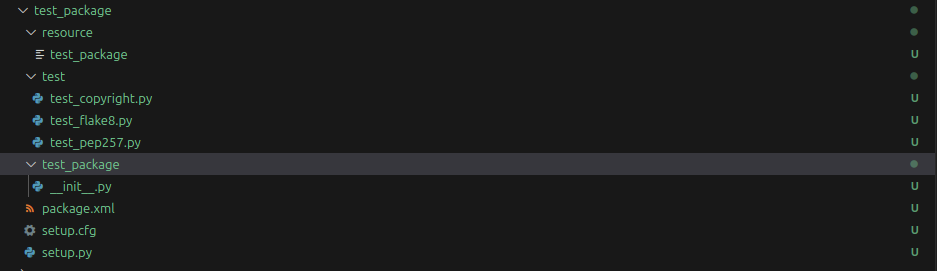

# <p style="text-align: center;"> Adding a New ROS2 Package to the Workspace </p>

## Python Packages

To create a new ROS2 python package, you should first run the following command in the `/home/ws/src` folder:

```sh
ros2 pkg create <Your Package Name Here> --build-type ament_python --dependencies rclpy
```

Once you have created your package, you should see a new folder pop up in `/home/ws/src` that looks a little bit like this:




Once you add the package, ensure that you run the following commands:

```sh
cd /home/ws && colcon build --symlink-install && source ~/.bashrc
```

This will rebuild the environment to recognize that the new package exists. Without this, ROS2 won't be able to find your new package.


A more comprehensive tutorial can be found here: [Comprehensive tutorial on how to create a ROS2 python package](https://www.youtube.com/watch?v=iBGZ8LEvkCY)

<br>

Once you have the ROS2 python package created, you should make your way to the next section on adding new ROS2 nodes, where we will talk about how to add new nodes to ROS2 python packages.

