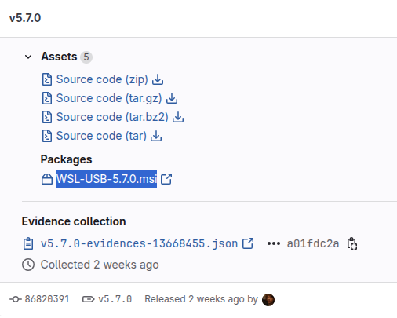
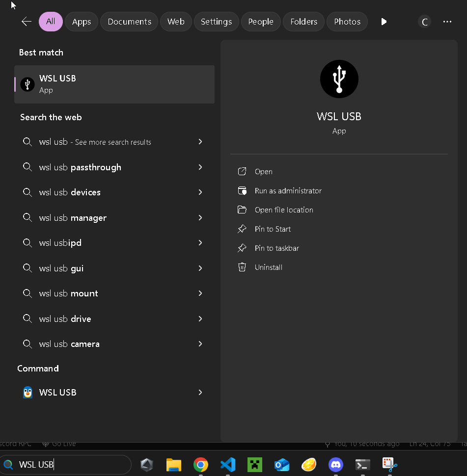

# 
 Connecting a USB Device to WSL 

!!!NOTE
	If you are on Linux or Mac, USB devices should *just work* in the dev containers, so you do not need any additional steps

Sometimes, we want to test usb devices and their respective ROS nodes before we run them with the Jetson such as the GPS, RC receiver, wind sensor, Raspberry Pi Pico, VESC, etc. Most people run Windows for their personal computer, and unfortunately we have to do some slightly jank things to get everything working on windows like it would work on the Jetson. One of which is giving USB devices to WSL so that WSL can have full access to read/ write to those USB devices. Unfortunately with how WSL works, USB devices have to belong to either WSL *or* Windows, so you have to manually give access over to WSL and by default, access is given to Windows.

 

Back in the day, we used to have to use a command line tool called [usbipd-win](https://github.com/dorssel/usbipd-win), but to put it bluntly, this tool sucks. You have to interact with powershell, manually bind and attach specific devices, and figuring out which device is mounted to which bus were all just annoying. Nowadays, there exists a GUI called WSL USB GUI that simplifies all of the process of binding and attaching a USB device between Windows and WSL.

## **How to Install WSL USB GUI**

- Go to the following releases page for the WSL USB GUI Tool: [Link to WSL USB GUI Releases Page](https://gitlab.com/alelec/wsl-usb-gui/-/releases/).

- Click on the .msi release option for Windows:

- Run the installer and click through all of the options with the defaults until you have installed WSL USB GUI

- Once you have finished installing the program, you should see the following show up if you search for WSL USB in the windows search bar:

- Run WSL USB GUI

- You should see the USB device that is plugged into your computer on here. Simply click on the device and then click "attach". Once the device is properly attached to WSL, you should see the device in the forwarded devices tab, and if this is true, that means that WSL can successfully see the USB device!