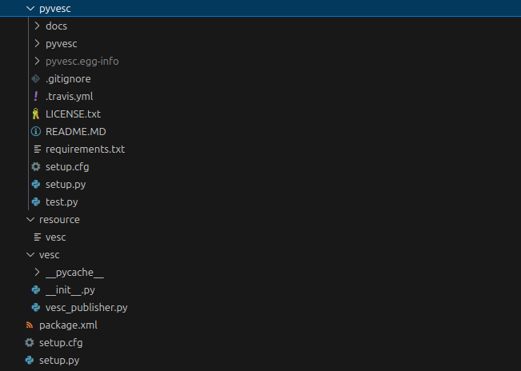
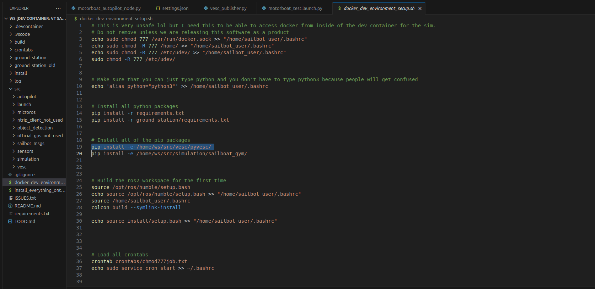

# <p style="text-align: center;"> How to Add External Libraries that We Can Edit</p>

Sometimes, we would like to use external pip packages, but still be able to edit the source code for them on the fly. One great example of this is the pyvesc library for the VESC node, where there are some minor differences between what the library does by default and what we want the library to do. In order to acheieve this, we will take advantage of the "-e" option in pip install, which allows us to install a *local pip package* as editable. Taking the example of the pyvesc library, here is how the source code is laid out:




Inside of the vesc ros2 package, we have the pyvesc library, which is very similar to the copy of the pyvesc library you can find here: [Official pyvesc Library](https://github.com/LiamBindle/PyVESC). This is where we would normally like to place our custom pip packages since it is easy to find what pip packages each ros2 package would like to use. Also, whenever you clone a git repository, it generates a folder named **.git** which contains all of the history of the repository. In short, we don't care about the history of the repository and in fact keeping this file makes it more annoying to use it in our codebase by automatically creating a nested repository. Nested repositories can become a nightmare to deal with, so to make all of our lives easier, just delete the .git folder. You can do so by using the rm -rf command:

```sh
rm -rf src/vesc/pyvesc/.git
```

Now that we have that working, we will need to make it so that we automatically install that package whenever someone runs `bash docker_dev_environment_setup.sh`. So, we need to add a line into the docker_dev_environment_setup.sh file like so:





This will automatically install the local pip package in editable mode, so if you make a change in the code of the pip package, then it will automatically reflect in any code that uses that package. If we did not have it in editable mode, then we would need to rebuild the package everytime we make a change to the source code. Now, to install the pip package, simply rerun `bash docker_dev_environment_setup.sh` and it should be ready to import in any python script inside of the dev container!