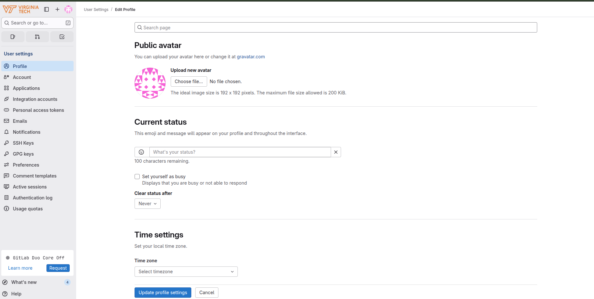
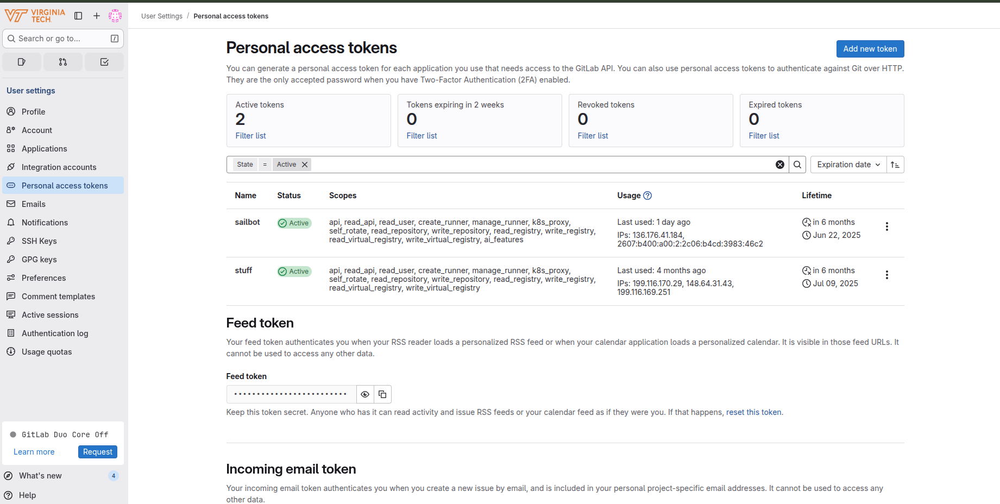
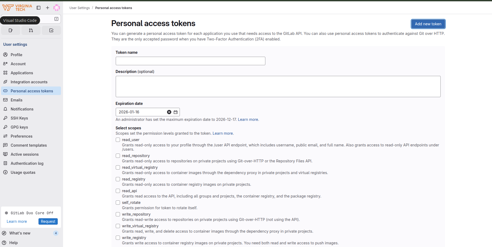
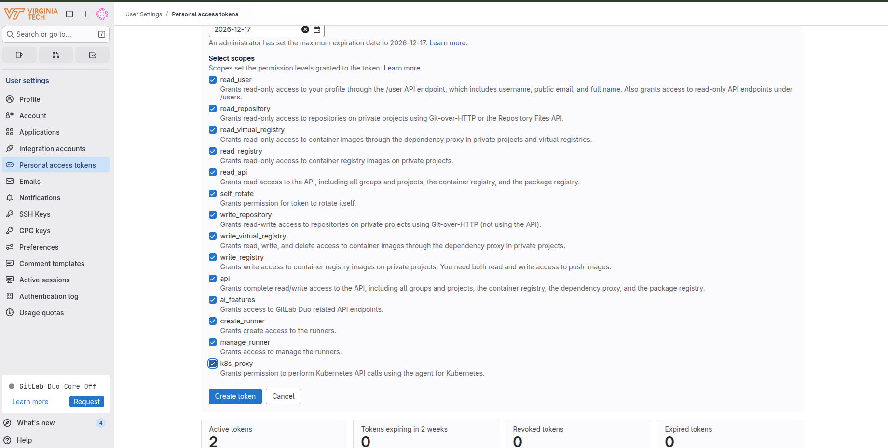

# <p style="text-align: center;">**How to Start Developing on the Website**</p>

Our website is hosted using Virginia Tech's website hosting platform called S4 Web Hosting, which can be found here: [S4 Web Hosting Link](https://4help.vt.edu/sp?id=sc_cat_item&sys_id=229f35ffdbd80700e3a0f839af96193a&pathname=%2Fsp%3Fid%3Dsc_cat_item%26sys_id%3D229f35ffdbd80700e3a0f839af96193a).

Since it is impractical to ask Virginia Tech's S4 Web Hosting team to add someone as a developer every time we want to add someone new to the website, we keep a copy of the website code in our Github orgranization. This way someone with access to both repositories can clone our repository to their computer and, using Git, set both the Github and S4 Web Hosting repositories to be "remotes" for their local copy of the website code. Then, when we want to push the changes from our Github repository to the S4 Web Hosting repository, we simply push to the S4 Web Hosting remote. This way, we can easily add new developers to the website without needing to ask the S4 Web Hosting team to add them every time.

Diagram of the process:  
Your local computer -> Github repository -> S4 Web Hosting repository

## <p style="text-align: center;">Getting Access to the S4 Site</p>

In order to get access to the S4 Site, you need to find someone who already has access to the website and tell them to complete the following steps. (If for any reason you can't contact anyone on the team perhaps because the team has been dormant for some number of years just fill out these steps yourself and hope that the admins allow you to get access to the site)

1. Since we can't directly add someone as a developer, we need to ask the S4 administrators to add them through a help ticket. Please go to the S4 Web Hosting Site found here: [S4 Hosting Site Link](https://4help.vt.edu/sp?id=sc_cat_item&sys_id=229f35ffdbd80700e3a0f839af96193a&pathname=%2Fsp%3Fid%3Dsc_cat_item%26sys_id%3D229f35ffdbd80700e3a0f839af96193a), login into your Virginia Tech account if you are not already logged in. If you are not logged in there should be a red button to the right of your screen that says something like "Login to Request This Service":
   

2. After you have logged in, you should be brought to the following screen with a red button to the right of your screen saying "Request This Service":
   

3. Once you click that button, you should be brought to a help ticket form, which you should fill out with all of the relevant information. Once filled out it should look something like the following:
   

The VT 4help team is usually very responsive and usually will get back to you within a day. Whenever they respond to you, you should receive an email notification, so look out for that.

Once the person trying to get access has been approved, they should be able to access the following site: [https://code.vt.edu/s4-hosting-sites/aoe/sailbot](https://code.vt.edu/s4-hosting-sites/aoe/sailbot). If they can't, that means that something went wrong, but if they can then you should move onto the next step.

## <p style="text-align: center;">Accessing the S4 Site</p>

In order to access the S4 Web Hosting site (aka code.vt.edu), you need to either setup an SSH key or use a personal access token. It is highly recommended that you setup an SSH key, and you may already be required to do this depending on the classes you are taking/taken.

### <p style="text-align: center;">Setting Up an SSH Key</p>

See the following link for instructions on how to set up an SSH key: [SSH Key Setup Link](https://docs.gitlab.com/user/ssh). If this link has changed or is no longer valid, we recommend you search for "How to set up an SSH key on GitLab" and follow the instructions provided by the most reputable source.

### <p style="text-align: center;">Creating a Personal Access Token</p>

If you are unable to set up an SSH key, you can use a personal access token to authenticate yourself. Here are the steps to create a personal access token:

1. From the website, please click on your profile picture in the top left:
   

2. There should be a drop down menu with the button "Edit Profile", so please click on that button.
   

3. Next, click on "Personal Access Tokens" button to the left of the screen.
   

4. Next, click the "Add New Token" button on the top right of the screen.
   

5. Next, enter a name for your token (you can call it whatever you want and it won't matter), and then enter an expiration date (after which time you will have to create another personal access token).
   

6. Next, select all of the "scopes" to allow this personal access token to do anything with your vt gitlab account (If you actually know what you are doing, then you can limit specific scopes but if you don't worry about it too much).
   

7. Once you click the blue "Create Token" button at the button of the screen, then you should be redirected to a screen like this:
   

At the top of the screen, there is a button to copy the newly created personal access token. If you refresh the page, this button will disappear so make sure you copy the personal access token and keep it somewhere on your computer. You will be asked to provide it whenever you have to push code from your computer to the website GitLab.

## <p style="text-align: center;">Git Configuration for Dual Remotes</p>

Run the following commands on your computer to clone the repository and to set everything up on your computer:

```sh
git clone https://github.com/autoboat-vt/website && cd website
git remote add aoe_sites https://code.vt.edu/s4-hosting-sites/aoe/sailbot
```

Then, whenever you want to push your changes to the gitlab and github, run the following commands:

```sh
git push origin main
git push aoe_sites main
```

Running `git push` on "aoe_sites" will deploy the site to the Gitlab (and therefore actually deploy it to the real website) and running `git push` on "origin" will deploy the site to the Github.
