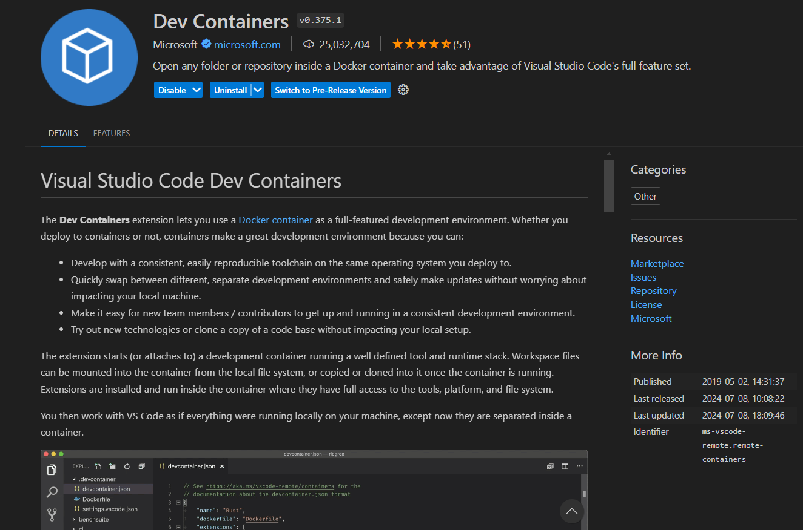
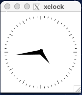
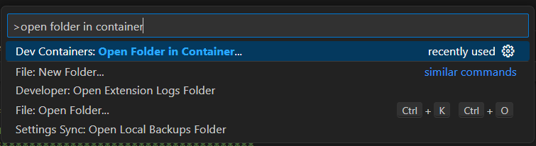

# <p style="text-align: center;"> Before Setting Up the Dev Environment </p>

Make sure that you have installed Docker before doing this step. The following steps will not work if Docker is not installed on your machine. The easiest way to check whether docker is installed correctly, open a terminal and type `docker`. If an error doesn't pop up that means that you can proceed!

!!!NOTE "mac OS Users" 
    In order for the simulation window to appear, you must install [XQuartz](https://www.xquartz.org/) as macos does not come with a x11 server. Please run the following command in your terminal:

    ``` sh
    brew install --cask xquartz
    ```

    After installation, please follow these steps:

    1. Launch XQuartz. Under the XQuartz menu, select Settings.
    2. Go to the Security tab and ensure "Allow connections from network clients" is checked.
    3. *Restart XQuartz*.


Also ensure that you have VSCode or some other IDE that supports docker dev environments installed (**If you are using Windows you install VSCode in WSL as well as on Windows**). For the purposes of this documentation, we will be using VSCode but there are plenty of other IDEs that support this and they each have their own documentation for how to get this setup.

# <p style="text-align: center;"> Installing the Development Container </p>

!!! Note "Windows Users"
    **If you are using Windows you must do all of the following commands in the WSL filesystem**

!!! Note "General"
    **Make sure that you have a Docker account and verify your email on that account, because it will ask you for your username and password**


- Next, we need to clone the main Github repository from the following URL: <https://github.com/autoboat-vt/autoboat_vt>. Open up a terminal and type the following commands:

```sh
git clone https://github.com/autoboat-vt/autoboat_vt && cd autoboat_vt
```


- Next, we need to run the following script:

```sh
sudo bash -c "source .devcontainer/setup_display_and_gpu.sh"
```


- Then, open up that folder in VSCode by typing the following into the same terminal:
   
```sh
code .
```


- Install the Docker Dev Containers Extension on VSCode. It should look like the following: 


!!!NOTE "mac OS Users" 
    To test whether or not XQuartz is working correctly, run either `xeyes` or `xclock` in your terminal. Your should see a new window appear with one of the following images.

    <p style="text-align: center;"></p>

    If you see one of these images, then XQuartz is working correctly.

- Build and enter dev container for the repo by typing in the following into the search bar at the top `>dev containers build`. You should see something similar to this at the top: . Wait for a moment as the container sets itself up!

# <p style="text-align: center;"> Final Setup after Loading Development Container </p>


Once you are inside your development container, go to the terminal and input the following command.

``` sh
source docker_dev_environment_setup.sh
```

!!!NOTE "mac OS Users" 
    To test the connection to the Docker container, run the following commands in the terminal in the Docker container:

    ``` sh
    sudo apt-get install -y x11-apps
    xeyes
    ```

    If you see a new window with eyes, then the connection is working correctly.

Restart VSCode by closing it and reopening it to make sure all of the changes refresh properly.


# <p style="text-align: center;"> Connecting Back to The Dev Container </p>

If you would like to close the container and resume development on it some other time then heres how you do that.
First, open a VSCode window and click on the search bar at the very top. Instead of searching like you would normally, instead type `>open folder in container`. Remember to include the "\>" as thats what allows your VSCode search bar to run commands. Once you do that you should get a popup that looks something like this:



Click on Dev Containers: Open Folder in Container.
This should navigate you to a file explorer. Using it, simply navigate to the folder that you cloned the github repo into and you should be back to your development container.
