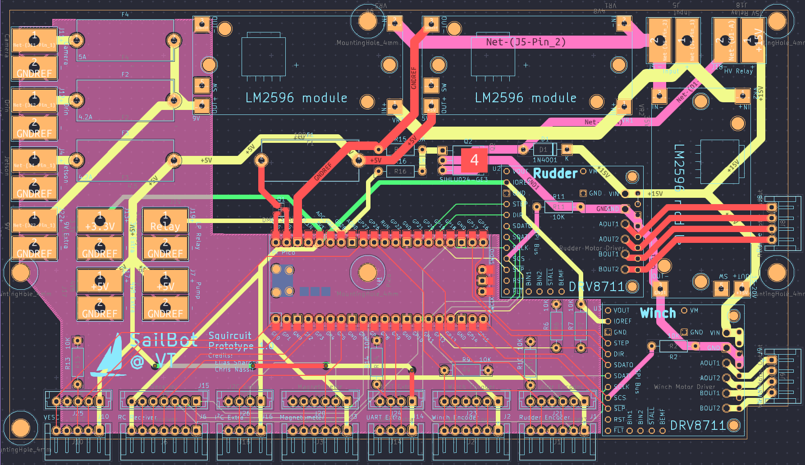
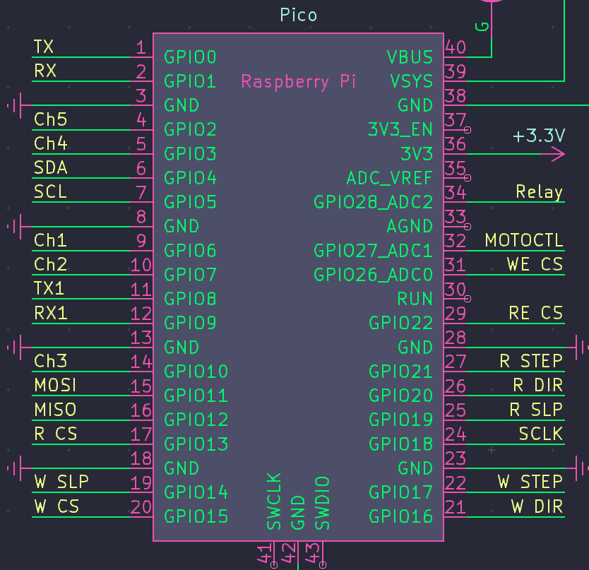

# 
 Squircuit 

Squircuit is the name of our PCB in development. It is intended to decrease the amount of wiring we have to do. The squircuit contains three buck converters for three different power lines (5V, 9V, and 15~20V), two slots for motor controllers, a relay driver, fuses, and the outputs. The images below show the layout of the entire crcuit as well as the pinout of specifically Pi Pico.

