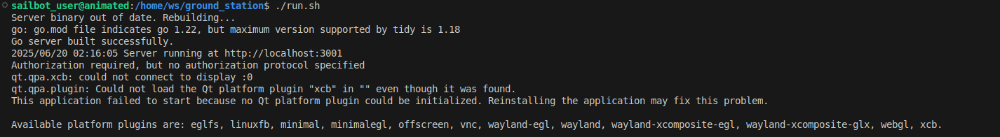

# <p style="text-align: center;"> Known Issues</p>


- In order to get full Intellisense, you need to restart the dev container after building it. Idk how to fix this man but just go with it. The issue might be that the Docker dev environment doesn't register the .vscode folder when it first starts up which is interesting... not sure how I would go about fixing it if thats the issue.

<br>

- If the groundstation gives the following error when you boot it up: 
 then run the following command in a WSL terminal if you are on windows, or on a linux terminal if you are on linux: 

```sh
echo "xhost + >> /dev/null" >> ~/.bashrc && source ~/.bashrc
```

Explanation for the groundstation error: 
your host operating system may not allow you to open x servers from inside of docker because "technically its a security vulnerability", but if you have not realized yet, security is our last priority here so we don't care. "xhost +" allows anyone to access your x server which lets them do whatever they want to your display, listen to keyboard inputs, etc. This command simply adds "xhost +" to your ~/.bashrc file, which is a series of bash commands that are run whenever your terminal opens. Then, the script runs the ~/.bashrc file to apply the changes.  ">> /dev/null" simply makes it so that the command doesn't print anything; this is not necessary at all but is nice so you don't have to see the same message everytime you open a terminal. 

<br>

- If the simulation is periodically freezing for no discernable reason then the issue is likely your system clock's synchronization, so please ensure that your system clock is synchronized to the internet. A common reason why your system clock may not be synchronized to the internet properly is if you have a dual boot, since dual boots often mess with timezone configurations.