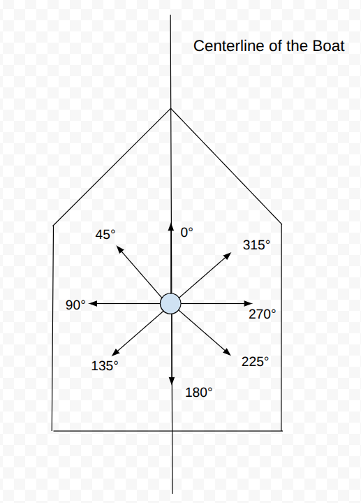
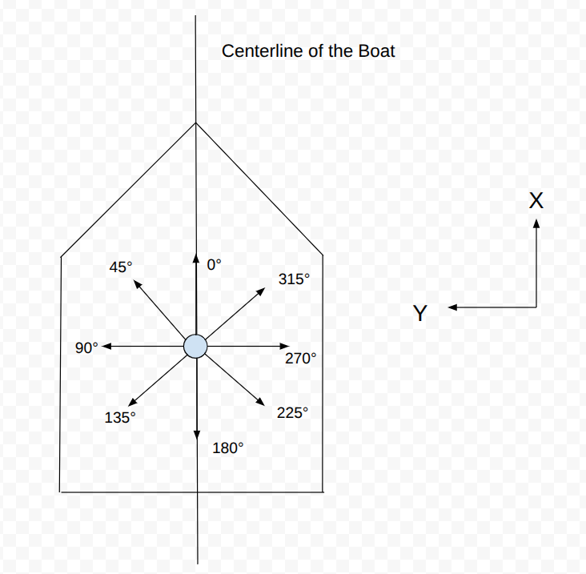

# 
 Standards and Definitions

## Units:

Unless stated otherwise, all variables are in SI units (meters, seconds, etc). All measurements of angles by default are in degrees from 0 to 360 degrees. 

## Definitions:

- Autopilot Mode: Autopilot mode typically refers to whether or not the autopilot is in RC control, a semi-autonomous mode like hold heading, or in a full autonomous mode. This is just a string that describes the autopilot mode for the telemetry.
   
- Full Autonomy Maneuver: The full autonomy maneuver is only really used for the sailboat in a fully autonomous mode. This describes whether the boat is currently tacking clockwise, tacking counterclockwise, or is normally sailing and navigating towards a specific heading.

## Wind Angle/ Vector Standards

There are several ways of measuring the wind direction and intensity that are each useful in different situations. The following are the main standards that we have chosen to go with; these exact definitions aren't standard across sailers, and you probably won't even find the words "Global True Wind Angle" anywhere online, but we believe that it is useful for our application and hopefully you will see why.

 
  

### Apparent Wind Angle

Apparent Wind Angle: The [Apparent Wind](https://en.wikipedia.org/wiki/Apparent_wind) is the wind measured on top of the boat. Imagine for a second that you are on a speedboat with no wind outside. When the speed boat is moving quickly, then you can feel the wind brush over your face because you are moving quickly even though there is no real wind. This is because you are moving into the air around you, which creates the sensation of wind and works in a similar way to [relative motion](https://en.wikipedia.org/wiki/Relative_velocity). The following Youtube video gives a pretty good explanation of apparent wind: [Apparent Wind Explanation Youtube Video](https://www.youtube.com/watch?v=ndL1FcTRPwU). The way that we measure this angle is counter-clockwise from the centerline of the boat, which visually looks like this if the boat is facing upwards:

This means that if the boat is going downwind, then the wind angle is 0 degrees. If the boat is going upwind, then the wind angle is 180 degrees. If the wind is blowing towards the left side of the boat, then the wind angle is 90 degrees. This measurement of the apparent wind direction and speed is really useful for managing the exact position of our sail because the direction that our sail should be pointing is dictated mainly by the apparent wind angle. The exact behaviour of the sail will always be defined by a lookup table, so for instance, if the boat is headed downwind, then the sail should be out all of the way. If the boat is heading directly upwind, then you will want to pull the sails all the way in.  

### How Are Wind Vectors Calculated?

In the next section about the true wind angle, we will talk about the true wind vector and the apparent wind vector, so it may be useful to define them since we have not talked about them before. Whenever we are talking about a wind vector in any standard, the vectors always have a specific definition in relation to their corresponding wind angles and magnitudes and it is the following:

$\text{wind_vector_x} = \text{wind_magnitude} * cos(\text{wind_angle})$

$\text{wind_vector_y} = \text{wind_magnitude} * sin(\text{wind_angle})$ 

This gives some pretty funky results when we start talking about the global true wind angle, but I promise it makes the math easier if you are able to follow along. Here are the x and y axes labeled for the apparent wind angle using this definition of the apparent wind vector:

This means that the axes that the apparent wind vector are based off of change if the heading/ direction of the boat changes. **You have to keep this fact in mind when doing calculations with the apparent wind vector because this is very important**.

### True Wind Angle

The true wind vector is basically just the wind speed of the location as measured by a stationary sensor, and is just computed by taking the apparent wind vector and adding the local velocity vector of the boat. **You must make sure that the velocity vector is measured using the same axes as the apparent wind vector. This is called the local velocity vector and is mentioned in a following section**. 

$\text{true_wind_angle} = \text{apparent_wind_vector} + \text{local_velocity_vector}$

The true wind angle is also measured counter-clockwise from the centerline of the boat just like the apparent wind angle, and the true wind vector has the same base axes as the apparent wind vector. The true wind angle doesn't actually do anything on its own, but it can be used to compute the global true wind angle, which is quite useful for us in plotting courses and in visualizations.

### Global True Wind Angle

As you may have realized, both of the two previous standards for determining the wind angle are relative to the centerline of the boat and if the direction of the boat changes, then the apparent/ true wind angles will change even if the real wind hasn't shifted. So in order to account for this, we would like to cancel out the direction the boat is facing from the true wind angle. The formula for this is quite simple: 

$\text{global_true_wind_angle} = \text{heading_counter_clockwise_from_true_east} + \text{true_wind_angle}$ 

I would encourage you to draw this out and convince yourself of why this fact is true and follows naturally from how we have defined everything so far.

This calculation gives us a really good sense of where the wind is actually going regardless of our current heading/ direction and regardless of our velocity vector, which is very useful for displaying wind information to a map and figuring out where the no sail zone is.

If you haven't realized already, this definition of the global true wind angle means that the global true wind vector has the x axis defined as true east and the y axis defined as true north. **This is very different from the apparent/ true wind vectors so keep that in mind. The apparent/ true wind vector will change if the boat changes directions but the global true wind vector does not change if the boat changes directions**.

## Global and Local Velocity

Similarly to the wind angle, there is a distinction between the global velocity and the local velocity. The global velocity is simply the velocity that the GPS gives us which is measured with the x axis being true east and the y axis being true north. In order to convert this into something where the x axis is the centerline of the boat and the y axis points to the left of the boat, we need to convert to the local velocity which can be done with the following equations:

$\text{boat_speed} = \sqrt{\text{global_velocity_vector_y}^2 + \text{global_velocity_vector_y}^2}$

$\text{global_velocity_angle} = arctan2(\text{global_velocity_vector_y}, \text{global_velocity_vector_x})$

$\text{local_velocity_angle} = \text{global_velocity_angle} - \text{heading_angle}$

$\text{local_velocity_vector_x} = \text{boat_speed} * cos(\text{local_velocity_angle})$

$\text{local_velocity_vector_y} = \text{boat_speed} * sin(\text{local_velocity_angle})$

arctan2 is defined as simply a function that takes in the x and y components of a vector and outputs the angle that vector makes counter-clockwise from the x axis. See the following link for more details: [Arctan2 Wikipedia Page](https://en.wikipedia.org/wiki/Atan2)

Now, similarly to the apparent/ true wind angle, local_velocity_vector_x faces the same direction as the centerline of the boat, and local_velocity_vector_y faces to the left of the boat. This version of the velocity vector can now be added to the apparent wind vector since now both of them are being measured the same way.