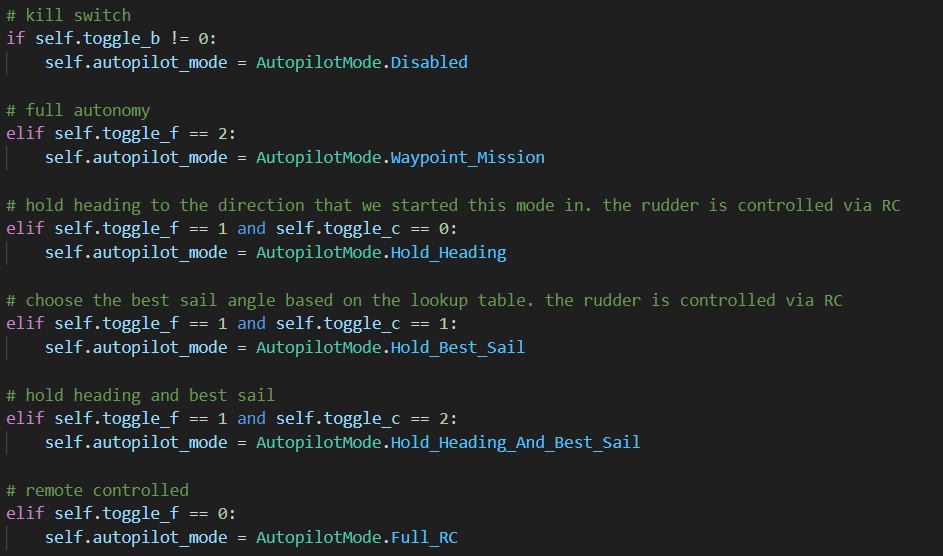

# 
 Autopilot Nodes 

## **Summary**
These nodes are responsible for listening to data about the current state of the boat and a set of waypoints and publishing the desired motor behaviour based on our autopilot software. These nodes run completely asynchronously on an internal timer, which means that a few times every seconds it runs a *non-blocking* script to calculate what the desired motor behaviours should be and publishes them when its done. This node does not actually have code to communicate with motors directly, but instead lets the microcontroller figure out the specifics of how to communicate with the motor.

Additionally, these nodes publish data that is useful for telemetry and debugging such as the the current maneuver it is attempting to perform and what its desired heading is currently.

An important thing to note is that these nodes also control basic RC override, which is why they need to listen into the raw RC data. There are several different types of RC override listed below:  

TODO: make this actually documented lol

 

## **The Autopilot Parameters System**

In order for us to be able to control and tune parameters for the autopilot from the groundstation, these nodes also listen for autopilot_parameters. These are jsons (serialized as strings) which detail all of the new parameters and what their values should be. These values are sent from the groundstation to the telemetry server, then to the telemetry node and then finally to the autopilot (a diagram of how exactly this is done can be found in the system diagrams). An example of these parameters is shown below:
  

Not all of the parameters need to be included in the json. If only some of the parameters are included, then only those parameters will get changed in the autopilot. The default parameters can be found in the config folder and whenever a parameter is not specified by the groundstation, it will default to the parameter values found in the config folder. Also, the default parameter files in the config folder represent all of the parameters that the autopilot can accept, so if you are ever curious about which parameters you can change in the autopilot, then please check out the default parameters files.

 

## **Choosing the Correct Rudder Angle**

One of the tasks that the autopilot aims to do is to choose the correct rudder angle, so that our boats can follow a certain heading. A lot of the time, this isn't so simple because of how non-linear this problem ends up being. So, we choose to use a PID controller to be flexible enough to handle non-linearity, while still having the option to revert back to a simple proportional controller. 

 

If you are lost on any of the controls terminology, then I would recommend that you look at some of the following resources: [Proportional Controller Tutorial](https://www.youtube.com/watch?v=E0rdLQLMZdA&t=1s) and [PID Controller Introduction](https://www.youtube.com/watch?v=UR0hOmjaHp0). These resources are just a start, and if you would like to work on the autopilot, I would highly recommend you look more into basic control theory and become intimately familiar with how these work. 