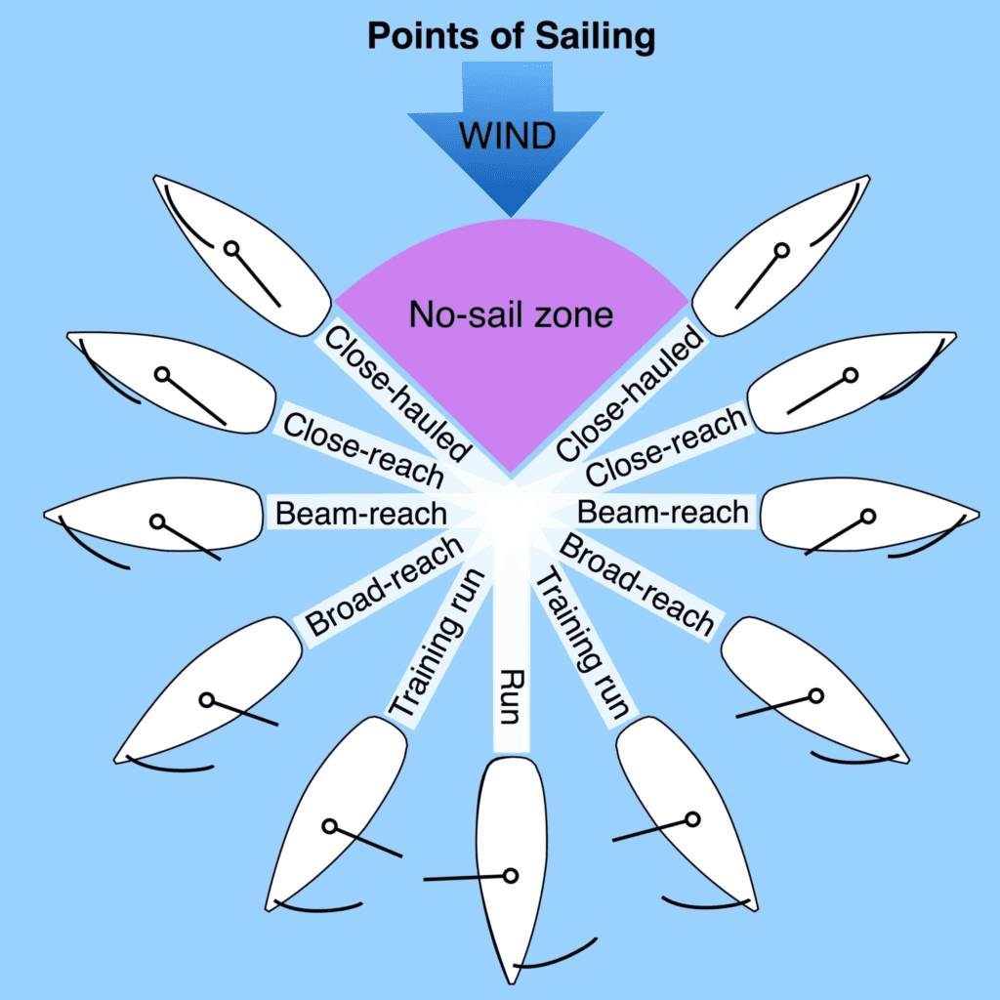
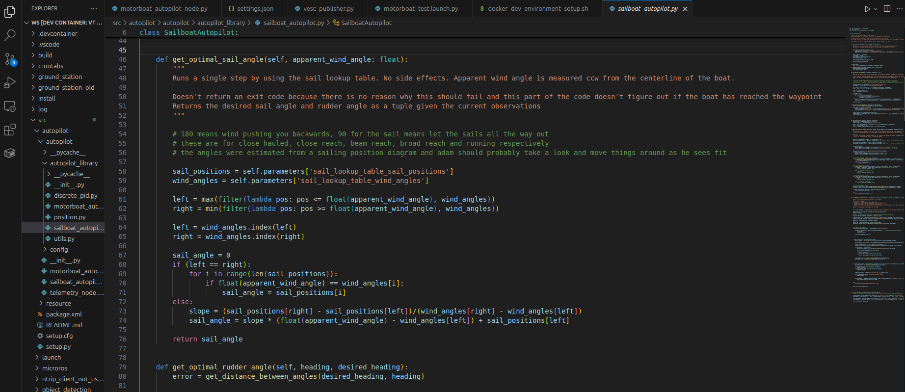
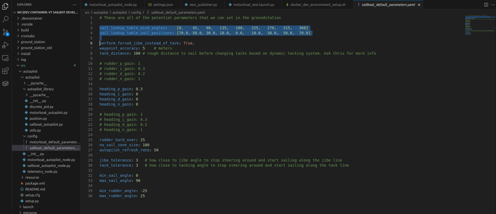
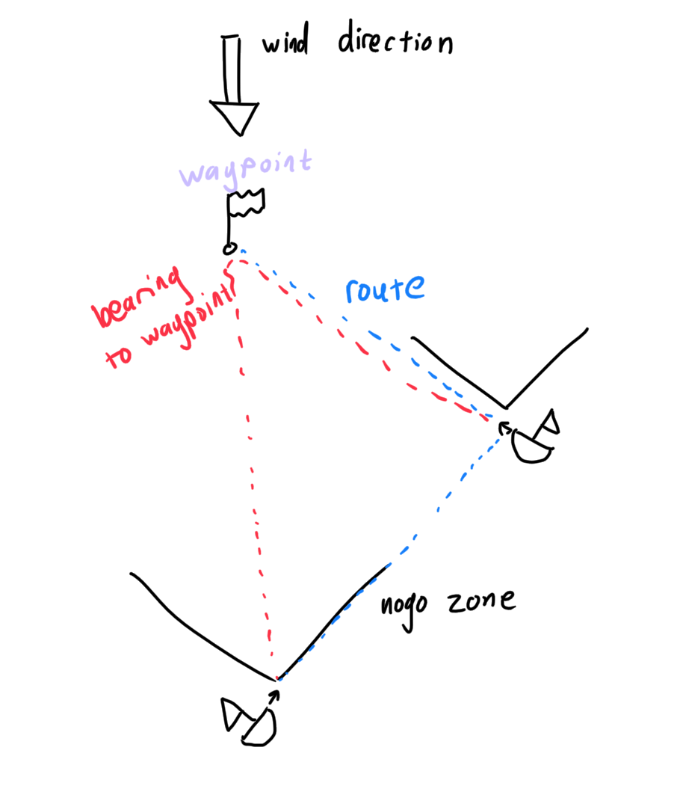
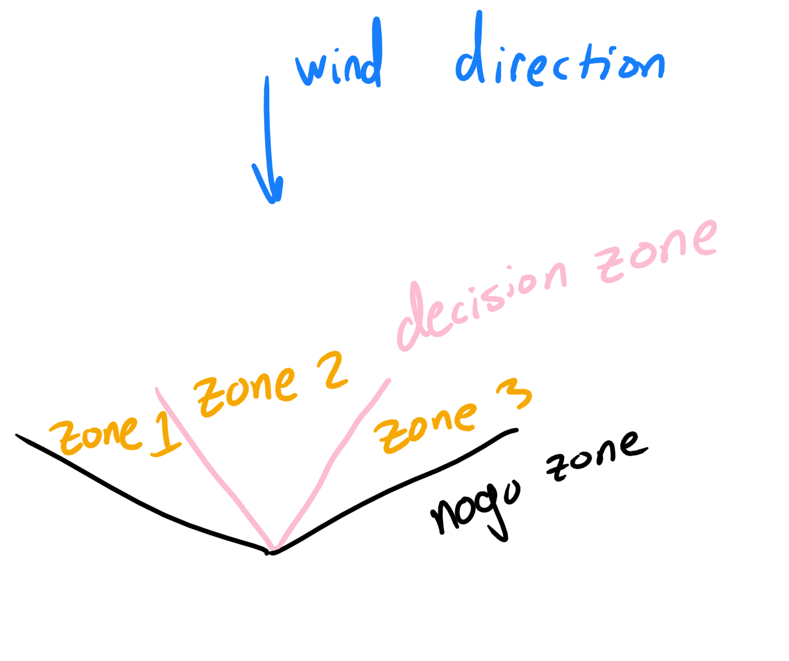
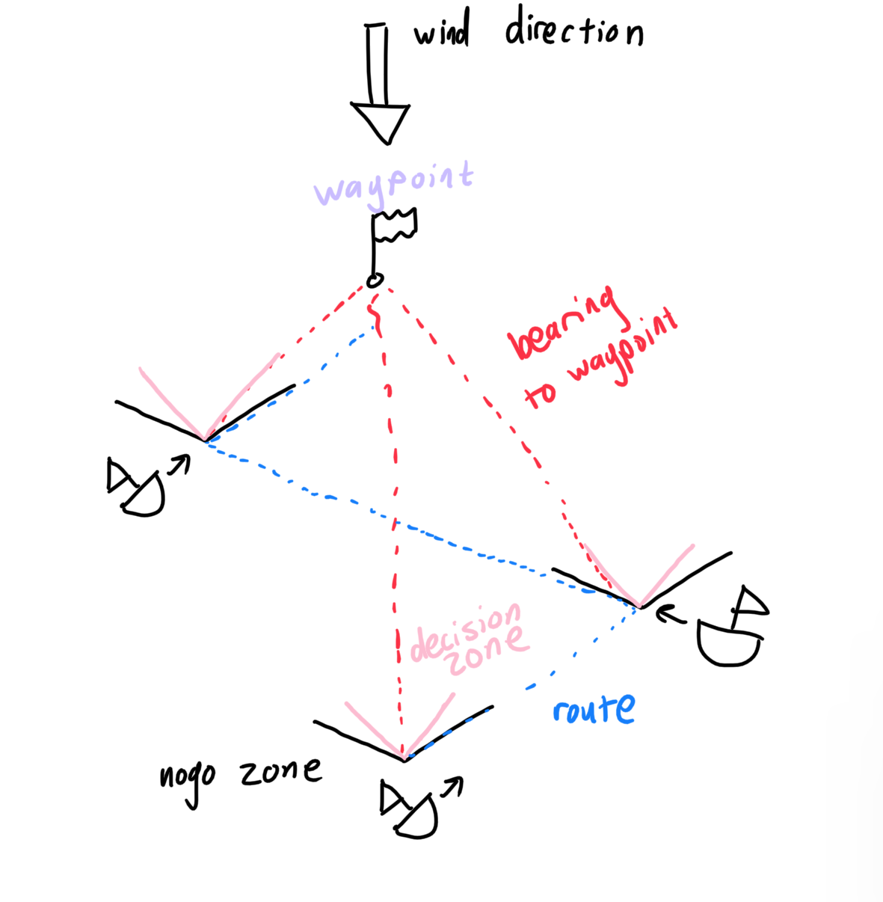
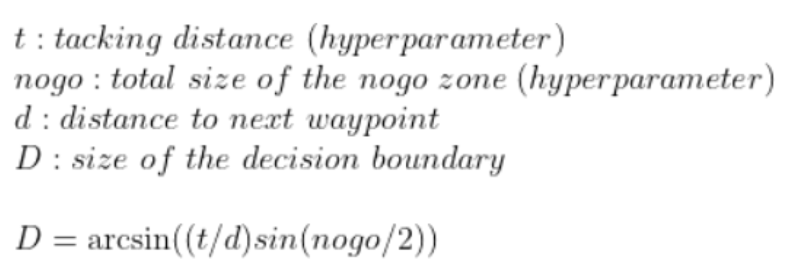

# <p style="text-align: center;"> Sailboat Autopilot </p>


## Choosing the Best Sail Angle

As it turns out, for any apparent wind angle, there is an optimal sail angle that you should turn the sail to. This is perhaps the only simple thing about the autopilot. There are plenty of diagrams such as the one below that demonstrate what those optimal sail angles are: 



As long as the sail angle follows this pattern for the sail angle, then the boat will be moving the fastest in that direction. To accomplish this, we use a lookup table that linearly interpolates between the optimal sail angles given in the sail lookup table (which is described in the autopilot parameters):





The code works by taking the two closest wind angles and their corresponding closest sail angles, then we construct a line out of that and figure out where we fall along that line. This is called linear interpolation. 


## How Do We Sail Upwind?

You may be wondering, how is the boat able to sail slightly upwind in the sailing diagram. Well, this is a neat quirk of sailing that is the entire reason why sailing is even possible in the first place. If we are able to hold an angle right outside of this "no sail zone", then we are able to gain some ground going upwind, and if we can go in a zig zag motion upwind, then we are able to move upwind and not make any net progress to the side. Here is a video that visually explains how it works: [Sailing Tutorial Video](https://www.youtube.com/watch?v=trwcNk8EeH0). Skip to 23:00 if you want the tacking explanation, but the entire video is pretty good, so I would recommend watching all of it.


## How Do We Determine When to Tack?


A very simple way to tack is to check whether the waypoint is in the no sail zone. If the waypoint is in the no sail zone, then keep a close hauled position (it doesn't matter too much whether you keep close hauled to the left of the waypoint or to the right of the waypoint). The boat will then keep that close hauled position until the waypoint goes out of the no sail zone, and then the boat will tack towards the waypoint and successfully capture the waypoint. This method will ensure that the boat will have to tack exactly once to get to its destination. A visual represntation of what this looks like is shown below:




To determine when to tack, we have to introduce a concept called decision zones. This concept doesn't really exist anywhere online because we invented it for autonomous tacking. Essentially if we create another zone inside of the nogo zone called the decision zone and pay attention to the line between the boat and the next waypoint, then whenever the line between the boat and the next waypoint is in "zone 1" then we should hold a tack on the left side of the wind. Whenever the line between the boat and the next waypoint is in "zone 3" then we should hold a tack on the right side of the wind. Finally, if the line is in zone 2, you should continue holding the tack that you were previously holding. A visual representation of the decision zone and what a path when using decision zone tacking can both be found below:






So then that begs the question, how large should the decision zone be. Well a couple of years ago, we had some team members derive the theoretically optimal decision zone size if you want to go a specific distance before tacking. This formula can be found below:




This formula is not perfect and can often be very wrong due to factors like noisy sensor data, the wind shifting, the boat drifting due to water currents, etc; however, it provides a good baseline for us to use in our algorithm.

Using the decision zone tacking strategy and constantely updating the size of our decision zone, we can efficiently sail upwind!


<br>

## **How to Run**

```sh
ros2 run autopilot sailboat_autopilot
```