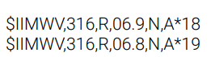
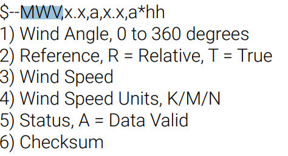

# 
 Wind Sensor 

## **Summary**
This node is responsible for communicating back and forth between our wind sensor ([Calypso Wind Sensor](https://calypsoinstruments.com/shop/product/ultra-low-power-ultrasonic-wind-meter-pro-ulp-pro-197?category=2#attr=116,117,120)). The wind sensor gives us NMEA0183 sentences that look may look like the picture below.  

 

The NMEA0183 message structure is very simple. The basics are that they always send a "$" when the message starts and separates different sub-messages with commas. If you would like to read more about NMEA0183, you can do so here: [NMEA0183 explanation](https://receiverhelp.trimble.com/alloy-gnss/en-us/NMEA-0183messages_MessageOverview.html).

 

Our wind sensor sends its sub-messages in the following order:

 
## **Publishes to the Following Topics**
- /position (NavSatFix from sensor_msgs)
- /velocity (Twist from geometry_msgs)