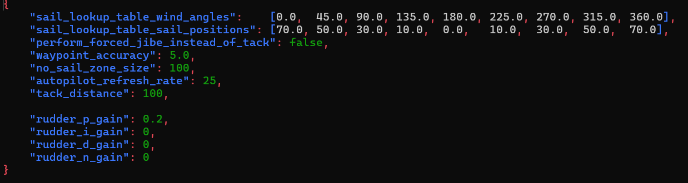

# 
 Autopilot Nodes 

## **Summary**
These nodes are responsible for listening to data about the current state of the boat and a set of waypoints and publishing the desired motor behaviour based on our autopilot software. These nodes run completely asynchronously on an internal timer, which means that a few times every seconds it runs a *non-blocking* script to calculate what the desired motor behaviours should be and publishes them when its done. This node does not actually have code to communicate with motors directly, but instead lets the microcontroller and vesc node figure out the specifics of how to communicate with the motor controllers.

Additionally, these nodes publish data that is useful for telemetry and debugging such as the the current maneuver it is attempting to perform and what its desired heading is currently.

An important thing to note is that these nodes also control basic RC override, which is why they need to listen into the raw RC data. There are several different types of RC override listed below:  

Above, you can find all of the different operating modes of the sailboat autopilot, which all depend on the current values of the toggle on the remote controller. The "toggle" or 3 way switches on the remote control are the main way that we select which autopilot mode we are in. Autopilot modes describe whether the autopilot is in RC mode, waypoint mission mode, hold current heading mode, etc etc. This encompasses all manner of autonomous and semiautonomous modes, which are useful to easily change from the ground. When the 3 way switch is all the way down (or in other words farthest away from you), then the switch is considered to be in "state 0". If the switch is in the middle, it is considered to be in "state 1", and if the switch is fully up (or fully towards you) then the switch is considered to be in "state 2".

The following is an explanation of what all of the current autopilot modes do. In the future, we will likely want to add more of these modes to have different behaviours. 

Disabled (sailboat + motorboat): The rudder/sail/propeller will not move and the boat is basically limp. This functions pretty much as a kill switch.

Full_RC (sailboat + motorboat): The rudder/sail or the rudder/propeller are both controlled by the remote controller.

Waypoint_Mission (sailboat + motorboat): The boat will attempt to follow a set of waypoints that are given to it by the groundstation.

Hold_Heading (sailboat + motorboat): The boat will attempt to keep the heading that it entered the Hold_Heading mode in with its rudder. For example, if you put the boat in Hold_Heading mode while the boat has a heading of 30 degrees, then the boat will attempt to keep its heading at 30 degrees. The sail/propeller is still controlled by the remote controller.

Hold_Best_Sail (sailboat): The boat will attempt to hold the best sail angle. Generally, for every state the boat is in, there is an optimal angle to hold the sail at. For more information, check out the [Sailboat Autopilot Documentation](sailboat_autopilot.md). The rudder is still controlled by the remote controller.

Hold_Heading_And_Best_Sail (sailboat): the boat will attempt to do Hold_Heading and Hold_Best_Sail at the same time.

 

## **The Autopilot Parameters System**

In order for us to be able to control and tune parameters for the autopilot from the groundstation, these nodes also listen for autopilot_parameters. These are jsons (serialized as strings) which detail all of the new parameters and what their values should be. These values are sent from the groundstation to the telemetry server, then to the telemetry node and then finally to the autopilot (a diagram of how exactly this is done can be found in the system diagrams). An example of these parameters is shown below:
  

Not all of the parameters need to be included in the json. If only some of the parameters are included, then only those parameters will get changed in the autopilot. The default parameters can be found in the config folder and whenever a parameter is not specified by the groundstation, it will default to the parameter values found in the config folder. Also, the default parameter files in the config folder represent all of the parameters that the autopilot can accept, so if you are ever curious about which parameters you can change in the autopilot, then please check out the default parameters files.

 

## **Choosing the Correct Rudder Angle**

One of the tasks that the autopilot aims to do is to choose the correct rudder angle, so that our boats can follow a certain heading. A lot of the time, this isn't so simple because of how non-linear this problem ends up being. So, we choose to use a PID controller to be flexible enough to handle non-linearity, while still having the option to revert back to a simple proportional controller. 

 

If you are lost on any of the controls terminology, then I would recommend that you look at some of the following resources: [Proportional Controller Tutorial](https://www.youtube.com/watch?v=E0rdLQLMZdA&t=1s) and [PID Controller Introduction](https://www.youtube.com/watch?v=UR0hOmjaHp0). These resources are just a start, and if you would like to work on the autopilot, I would highly recommend you look more into basic control theory and become intimately familiar with how these work. 