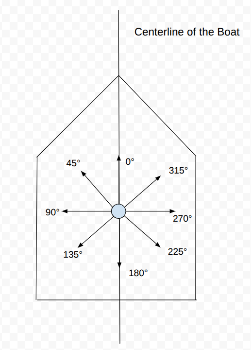

# 
 Standards and Definitions

## Definitions:

- Autopilot Mode: Autopilot mode typically refers to whether or not the autopilot is in RC control, a semi-autonomous mode like hold heading, or in a full autonomous mode. This is just a string that describes the autopilot mode for the telemetry.
   
- Full Autonomy Maneuver: The full autonomy maneuver is only really used for the sailboat in a fully autonomous mode. This describes whether the boat is currently tacking clockwise, tacking counterclockwise, or is normally sailing and navigating towards a specific heading.

## Wind Angle/ Vector Standards

There are several ways of measuring the wind direction and intensity that are each useful in different situations. The following are the main standards that we have chosen to go with; these exact definitions aren't standard across sailers, and you probably won't even find the words "Global True Wind Angle" anywhere online, but we believe that it is useful for our application and hopefully you will see why.

 
  

### Apparent Wind Angle

Apparent Wind Angle: The [Apparent Wind](https://en.wikipedia.org/wiki/Apparent_wind) is the wind measured on top of the boat. Imagine for a second that you are on a speedboat with no wind outside. When the speed boat is moving quickly, then you can feel the wind brush over your face because you are moving quickly even though there is no real wind. This is because you are moving into the air around you, which creates the sensation of wind and works in a similar way to [relative motion](https://en.wikipedia.org/wiki/Relative_velocity). The following Youtube video gives a pretty good explanation of apparent wind: [Apparent Wind Explanation Youtube Video](https://www.youtube.com/watch?v=ndL1FcTRPwU). The way that we measure this angle is counter-clockwise from the centerline of the boat, which visually looks like this if the boat is facing upwards:

This means that if the boat is going downwind, then the wind angle is 0 degrees. If the boat is going upwind, then the wind angle is 180 degrees. If the wind is blowing towards the left side of the boat, then the wind angle is 90 degrees. This measurement of the apparent wind direction and speed is really useful for managing the exact position of our sail because the direction that our sail should be pointing is dictated mainly by the apparent wind angle. The exact behaviour of the sail will always be defined by a lookup table, so for instance, if the boat is headed downwind, then the sail should be out all of the way. If the boat is heading directly upwind, then you will want to pull the sails all the way in.  

### How Are Wind Vectors Calculated?

In the next section about the true wind angle, we will talk about the true wind vector and the apparent wind vector, so it may be useful to define them since we have not talked about them before. Whenever we are talking about a wind vector in any standard, the vectors always have a specific definition in relation to their corresponding wind angles and magnitudes and it is the following:

$wind_vector_x = wind_magnitude * cos(wind_angle)$

$wind_vector_y = wind_magnitude * sin(wind_angle)$ 

### True Wind Angle

The true wind vector is basically just the wind speed of the location as measured by a stationary sensor, and is just computed by taking the apparent wind vector and adding the velocity vector of the boat. The true wind angle is also measured counter-clockwise from the centerline of the boat just like the apparent wind angle. This measurement doesn't actually do anything on its own, but it can be used to compute the global true wind angle, which is quite useful for us in plotting courses and in visualizations.

### Global True Wind Angle

As you may have realized, both of the two previous standards for determining the wind angle are relative to the centerline of the boat and if the direction of the boat changes, then the apparent/ true wind angles will change even if the real wind hasn't shifted. So in order to account for this, we would like to cancel out the direction the boat is facing from the true wind angle. The formula for this is quite simple: 

global_true_wind_angle = heading_counterclockwise_from_true_east + true_wind_angle 

