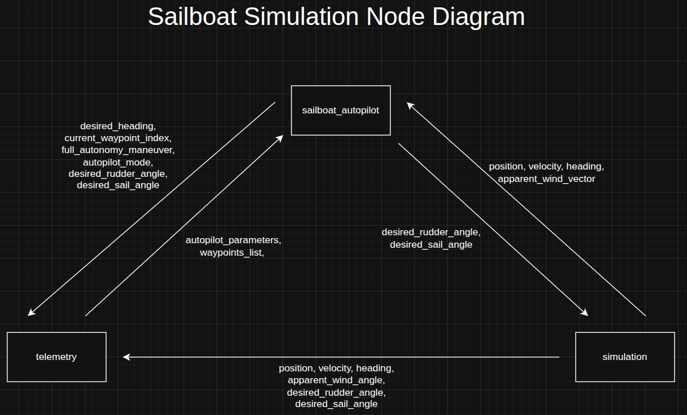
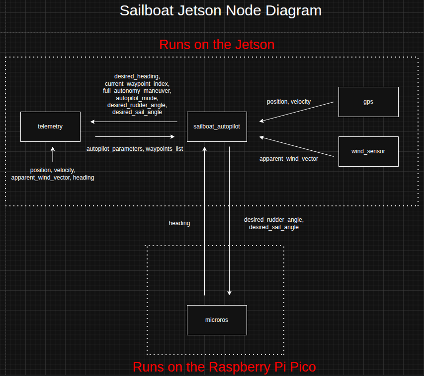
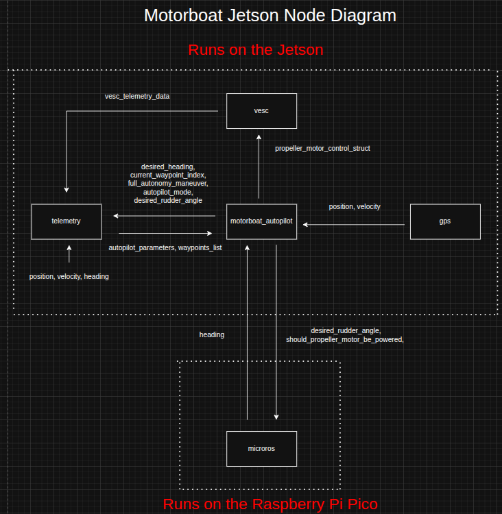

# 
 How Nodes Interact on the Sailboat Simulation 

The following is the source file if you want to make edits to the diagram: [Sailboat Simulation Node Diagram Source File Download](../system_diagram_files/ros2_node_diagram_sailboat_simulation.drawio.xml)

 

# 
 How Nodes Interact on the Sailboat on Real Hardware

The following is the source file if you want to make edits to the diagram: [Sailboat Simulation Node Diagram Source File Download](../system_diagram_files/ros2_node_diagram_sailboat_jetson.drawio.xml)

 

# 
 How Nodes Interact on the Motorboat on Real Hardware 

The following is the source file if you want to make edits to the diagram: [Sailboat Simulation Node Diagram Source File Download](../system_diagram_files/ros2_node_diagram_motorboat_jetson.drawio.xml)
