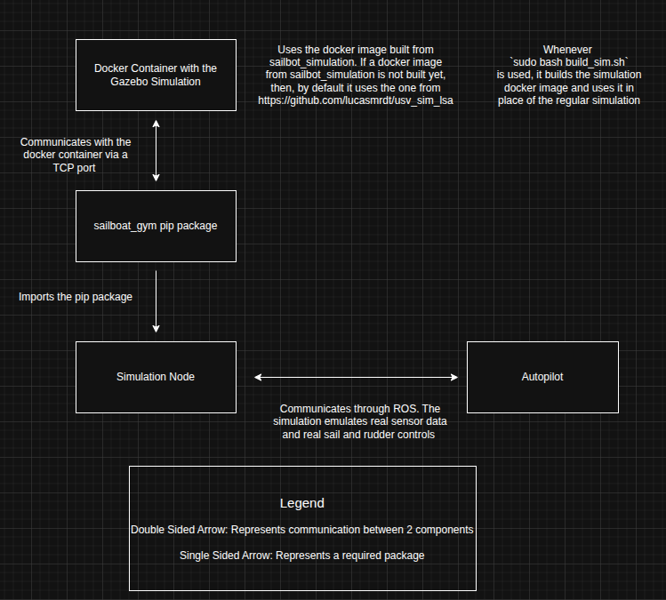

# 
 How Each of the Different Codebases Contributing to the Simulation Interact 

The following is the source file if you want to make edits to the diagram: [Simulation Diagram Source File Download](../system_diagram_files/autoboat_simulations.drawio.xml)
