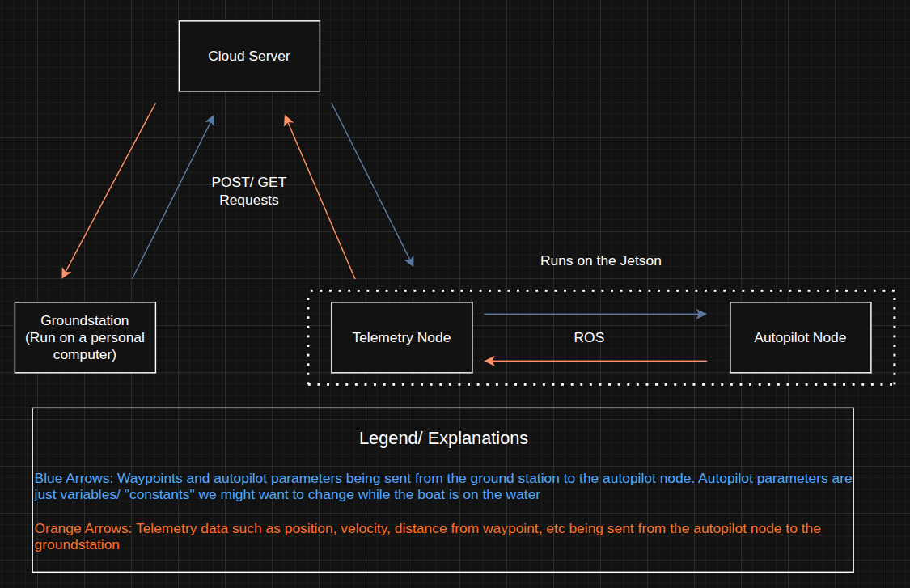

# 
 **Telemetry Server Overview** 

As shown above, both the telemetry node and the groundstation will communicate with the telemetry server to send and receive information about the boat. The telemetry server is implemented as a Python [Flask](https://flask.palletsprojects.com/en/stable/) API that both the groundstation and the telemetry node on the jetson use as an intermediary to exchange messages.

## 
 **Future Plans** 

In the future, we would like to support having multiple boats/ simulations talking to the telemetry server at the same time. The end goal of this is to have the groundstation be able to choose which boat to connect to so you can receive telemetry data and send parameters to a specific boat thats currently active.

In the future, we will want to make this API more RESTful which means that we need to remove everything that we are storing in memory and instead store data in specific databases. This way, if the server goes down, the information will still be present since it is stored in the filesystem instead of in RAM. 